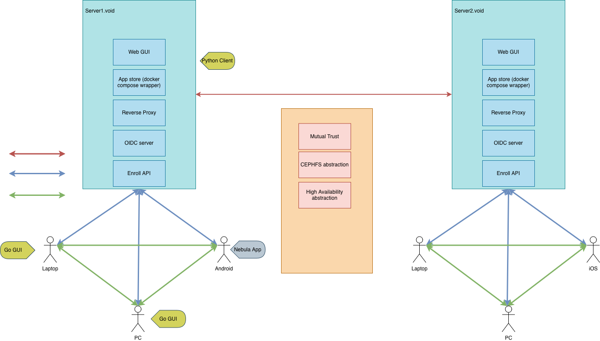

usage:

```
uv sync
uv pip install -e .

# start api
uv run cloudbox-server set-auth-token
uv run cloudbox server run

# run the cli
uv run cloudbox auth
uv run cloudbox --help

# create a network
uv run cloudbox create-network
uv run cloudbox list-networks

# create a host and connect (first one needs to be a lighthouse)
uv run cloudbox create-host <network-name> <host-name> [--am-lighthouse --public-ip <public-ip>]
uv run cloudbox connect <network-name> <host-name>
```

## Architecture diagram

